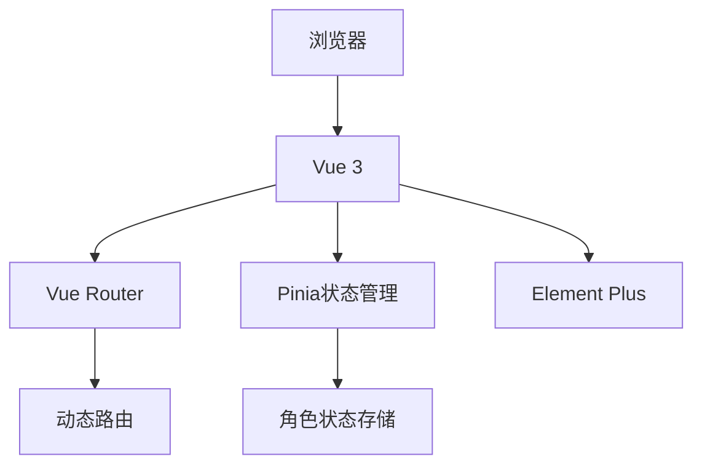

# 校园博客系统

一个基于Vue 3 + Spring Boot的校园博客系统，采用RBAC权限模型实现多角色管理。

## 功能特性

### 角色权限体系
- **学生** 
  - 发帖/评论/浏览
  - 编辑个人帖子
  - 收藏优质内容
  
- **教师**
  - 审核帖子内容
  - 发布公告并置顶
  - 管理专业板块
  - 特殊身份标识
  
- **管理员**
  - 用户账户管理
  - 权限分配
  - 系统日志监控
  - 全局内容管理

- 用户注册与登录（带验证码）
- 登录尝试限制（防止暴力破解）
- 密码加密存储
- 博客文章发布
- 响应式设计
- 基于JWT的权限验证

## 技术栈

### 前端架构


- 前端：Vue 3 + Vue Router + Pinia + Element Plus
- 后端：Spring Boot 3.x + Spring Security + MyBatis-Plus
- 数据库：SQL Server 2022
- 安全：Spring Security + JWT + RBAC

1. 克隆仓库：
   ```bash
   git clone https://github.com/your-repo/blog.git
   cd blog
   # 前端安装
   cd client && npm install
   # 后端安装（Maven项目）
   cd ../server && mvn clean install
